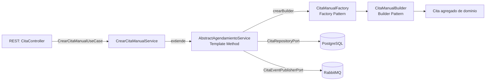

# Piedrazul Microservices

Sistema distribuido para la gestion de procesos clinicos, enfocado en usuarios, personas (pacientes y medicos), citas y notificaciones, con una aplicacion de escritorio JavaFX como cliente.

## Vision General

El proyecto implementa una arquitectura de microservicios con responsabilidades separadas:

- `api-gateway`: punto de entrada unico, enruta las peticiones del frontend hacia los microservicios.
- `usuarios-service`: autenticacion, gestion de cuentas y roles.
- `personas-service`: gestion de datos de pacientes, medicos y disponibilidad.
- `citas-service`: orquestacion del ciclo de vida de las citas (crear, cancelar, reagendar, historial).
- `notifications-service`: consumo/publicacion de eventos para notificaciones.
- `piedrazul-frontend`: cliente JavaFX que consume los servicios REST exclusivamente a traves del Gateway.

La comunicacion combina:

- **Sincrona** por HTTP/REST: el frontend habla SOLO con el API Gateway, y este enruta a los microservicios downstream.
- **Asincrona** con RabbitMQ para eventos de dominio entre servicios.

## Arquitectura del Repositorio

```text
piedrazul_microservices/
|- api-gateway/
|- usuarios-service/
|- personas-service/
|- citas-service/
|- notifications-service/
|- piedrazul-frontend/
`- README.md
```

## Flujo de Comunicacion

```text
                       +----------------+
   piedrazul-frontend  |  API Gateway   |  --->  usuarios-service   (8081)
   (JavaFX) ---------> |  (puerto 8080) |  --->  personas-service   (8082)
                       |                |  --->  citas-service      (8083)
                       +----------------+  --->  notifications-svc  (8084)
                                                       ^
                                                       |
                                                 RabbitMQ (eventos)
```

El frontend NO habla directamente con los microservicios. Toda llamada REST
se hace al Gateway en `http://localhost:8080`, que enruta por path al
microservicio correspondiente sin reescritura.

## Stack Tecnologico

- Java 17/21 (segun modulo)
- Spring Boot (Web, Validation, JPA, Security)
- PostgreSQL (driver presente en servicios principales)
- RabbitMQ (mensajeria AMQP)
- OpenAPI/Swagger UI (`springdoc-openapi`)
- JavaFX (cliente de escritorio)
- Maven (build y ejecucion)

## Servicios y Responsabilidades

### `api-gateway`

Punto de entrada unico para el frontend. Implementado con **Spring Cloud Gateway (reactivo, WebFlux)** sobre **Spring Boot 3.5.13** y **Spring Cloud 2025.0.0**.

Caracteristicas de la primera version:

- Ruteo **estatico** definido en `application.yml` (sin service discovery).
- Ruteo **transparente**: el path que entra al Gateway es el mismo que llega al microservicio downstream. No se reescriben los paths.
- **CORS global** habilitado para cualquier origen (preparado para futuros frontends web).
- Endpoints de **Actuator** para diagnostico:
  - `GET /actuator/health`
  - `GET /actuator/gateway/routes` (lista de rutas activas)

Tabla de ruteo:

| Path predicate | Destino downstream |
|---|---|
| `/api/auth/**` | `http://localhost:8081` |
| `/api/usuarios/**` | `http://localhost:8081` |
| `/api/personas/**` | `http://localhost:8082` |
| `/api/pacientes/**` | `http://localhost:8082` |
| `/api/medicos/**` | `http://localhost:8082` |
| `/api/disponibilidad/**` | `http://localhost:8082` |
| `/api/citas/**` | `http://localhost:8083` |
| `/api/configuracion/**` | `http://localhost:8083` |
| `/api/notificaciones/**` | `http://localhost:8084` |

### `usuarios-service`

Responsable de autenticacion y gestion de usuarios.

Endpoints principales:

- `POST /api/auth/login`
- `GET /api/usuarios/{id}`
- `POST /api/usuarios/{id}/roles`

### `personas-service`

Responsable de informacion clinica base de personas.

Endpoints principales:

- `GET /api/personas/{id}`
- `GET /api/pacientes/{personaId}`
- `GET /api/medicos/{personaId}`
- `GET /api/medicos/activos`
- Base de disponibilidad en `/api/disponibilidad`

### `citas-service`

Responsable del flujo de citas y configuracion.

Endpoints principales:

- `POST /api/citas/manual`
- `POST /api/citas/autonoma`
- `PUT /api/citas/{citaId}/cancelar`
- `PUT /api/citas/reagendar`
- `PUT /api/citas/asistencia`
- `GET /api/citas/medicos/{medicoId}/slots`
- `GET /api/citas/historial`
- Base de configuracion en `/api/configuracion`

### `notifications-service`

Responsable de notificaciones por eventos.

Endpoint visible:

- `POST /api/notificaciones/cita-agendada`

Adicionalmente consume/publica mensajes en RabbitMQ para eventos de citas.

### `piedrazul-frontend`

Cliente de escritorio JavaFX con vistas FXML para:

- Login y registro
- Dashboard por perfil
- Historial y gestion de citas
- Integracion con APIs de usuarios, personas y citas **a traves del API Gateway**

La URL del Gateway se resuelve en cascada por `com.piedrazul.frontend.config.ApiConfig`:

1. Variable de entorno `PIEDRAZUL_GATEWAY_URL` (ideal para Docker/CI).
2. Propiedad `piedrazul.gateway.url` en `src/main/resources/application.properties`.
3. Fallback: `http://localhost:8080`.

Ejemplos:

```bash
# Desarrollo local (no requiere nada)
mvn clean javafx:run

# Sobrescribiendo por variable de entorno (Windows PowerShell)
$env:PIEDRAZUL_GATEWAY_URL="http://gateway.local:8080"; mvn clean javafx:run

# Sobrescribiendo por variable de entorno (Linux/macOS)
PIEDRAZUL_GATEWAY_URL=http://gateway.local:8080 mvn clean javafx:run
```

## Arquitectura del Microservicio `citas-service` (DDD + Hexagonal)

El microservicio `citas-service` se implementa siguiendo **Domain-Driven Design** y la **Arquitectura Hexagonal** (Ports & Adapters), seleccionado por concentrar la logica de negocio mas rica del sistema (estados de cita, reglas de reagendamiento, restricciones de autoservicio, validacion de disponibilidad).

### Vista por capas

```text
citas-service/
`- src/main/java/com/piedrazul/citas/
   |- domain/                Reglas de negocio puras
   |  |- model/              Agregados, entidades, value objects, snapshots
   |  |- valueobjects/       CitaId, PacienteId, MedicoId, UsuarioId
   |  |- builder/            CitaBuilder (Builder Pattern)
   |  |- factory/            CitaBuilderFactory + impls (Factory Pattern)
   |  `- exception/          Excepciones del lenguaje del negocio
   |
   |- application/           Casos de uso / orquestacion
   |  |- port/incoming/      Puertos de entrada (use cases)
   |  |- port/outgoing/      Puertos de salida (interfaces hacia infra)
   |  |- service/            Implementacion de use cases
   |  |  `- agendamiento/    Template Method para crear citas
   |  |- dto/                Requests y responses de aplicacion
   |  `- mapper/             Mapeo dominio -> respuesta
   |
   |- infrastructure/        Adaptadores tecnicos
   |  |- persistence/        JPA: entities, repositories, mappers
   |  |- messaging/          RabbitMQ: publishers, consumers, events
   |  `- config/             Configuracion Spring (Rabbit, OpenAPI, etc.)
   |
   `- interfaces/            Adaptadores de entrada
      `- rest/               Controllers, DTOs REST, mapeo y excepciones HTTP
```

### Puertos y Adaptadores

**Puertos de entrada (`application/port/incoming/`)** — definen las operaciones que el sistema ofrece:

| Puerto (Use Case) | Adaptador de entrada |
| --- | --- |
| `CrearCitaManualUseCase` | `CitaController.crearCitaManual` (`POST /api/citas/manual`) |
| `CrearCitaAutonomaUseCase` | `CitaController.crearCitaAutonoma` (`POST /api/citas/autonoma`) |
| `CancelarCitaUseCase` | `CitaController.cancelarCita` (`PUT /api/citas/{id}/cancelar`) |
| `ReagendarCitaUseCase` | `CitaController.reagendarCita` (`PUT /api/citas/reagendar`) |
| `MarcarAsistenciaUseCase` | `CitaController.marcarAsistencia` (`PUT /api/citas/asistencia`) |
| `ConsultarSlotsDisponiblesUseCase` | `CitaController.obtenerSlots` (`GET /api/citas/medicos/{id}/slots`) |
| `ListarCitasUseCase` | `CitaController.listar` (`GET /api/citas/historial`) |
| `ConsultarConfiguracionUseCase` / `ActualizarConfiguracionUseCase` | `ConfiguracionController` (`/api/configuracion`) |

**Puertos de salida (`application/port/outgoing/`)** — definen lo que el sistema necesita del exterior:

| Puerto | Adaptador de salida (infraestructura) |
| --- | --- |
| `CitaRepositoryPort` | `CitaRepositoryImpl` (JPA / PostgreSQL) |
| `PacienteSnapshotRepositoryPort` | `PacienteSnapshotRepositoryImpl` (JPA) |
| `MedicoSnapshotRepositoryPort` | `MedicoSnapshotRepositoryImpl` (JPA) |
| `DisponibilidadSnapshotRepositoryPort` | `DisponibilidadSnapshotRepositoryImpl` (JPA) |
| `ConfiguracionRepositoryPort` | `ConfiguracionRepositoryImpl` (JPA) |
| `CitaEventPublisherPort` | `CitaEventPublisherImpl` (RabbitMQ) |

Los eventos entrantes (`PacienteCreado`, `MedicoCreado`, `MedicoActualizado`, `DisponibilidadActualizada`) son recibidos por consumers en `infrastructure/messaging/consumer/` y traducidos a operaciones sobre los puertos de salida correspondientes (anti-corruption layer entre el bus y el dominio).

### Patrones de diseno implementados

- **Builder** (`domain/builder/CitaBuilder` con `CitaManualBuilder` y `CitaAutonomaBuilder`): construye agregados `Cita` aplicando validaciones especificas segun el tipo de agendamiento.
- **Factory** (`domain/factory/CitaBuilderFactory` con `CitaManualFactory` y `CitaAutonomaFactory`): provee el `CitaBuilder` adecuado al caso de uso, desacoplando la creacion concreta del flujo de aplicacion.
- **Template Method** (`application/service/agendamiento/AbstractAgendamientoService`): define el algoritmo comun de agendamiento (cargar snapshots, validar disponibilidad, persistir, publicar evento) y delega en cada subclase la validacion especifica por tipo.
- **Singleton** (`application/service/singleton/ConfiguracionManager`): mantiene en memoria la configuracion vigente del sistema para acceso rapido desde la logica de negocio.

### Reglas y excepciones de dominio

El agregado `Cita` expone metodos que encapsulan las invariantes del negocio (`cancelar`, `reagendar`, `marcarComoAtendida`, `marcarComoNoAsistida`). Las violaciones se expresan con excepciones del lenguaje ubicuo:

| Excepcion de dominio | HTTP devuelto |
| --- | --- |
| `CitaNoEncontradaException` | `404 NOT_FOUND` |
| `PacienteNoExisteException` | `404 NOT_FOUND` |
| `MedicoNoDisponibleException` | `409 CONFLICT` |
| `DisponibilidadNoDisponibleException` | `409 CONFLICT` |
| `CitaNoCancelableException` | `400 BAD_REQUEST` |
| `CitaNoReagendableException` | `409 CONFLICT` |
| `CitaNoMarcableException` | `409 CONFLICT` |
| `RestriccionAutoservicioException` | `400 BAD_REQUEST` |

El mapeo se realiza de forma centralizada en `interfaces/rest/exception/GlobalExceptionHandler`.

### Flujo de un caso de uso (ejemplo: crear cita)



### Pruebas

La logica del dominio esta cubierta por tests unitarios (`src/test/java/.../domain/`): agregado `Cita`, value objects, `TimeRange`, builders y snapshots. La suite actual es de **49 tests** ejecutables con `mvn test`.

## Requisitos Previos

- JDK 21 recomendado (algunos modulos usan Java 17; Java 21 es compatible para desarrollo moderno)
- Maven 3.9+
- PostgreSQL
- RabbitMQ
- Git

## Configuracion de Entorno

En el repositorio no se incluyen archivos `application.yml`/`application.properties` versionados para los **microservicios de negocio**, por lo que debes configurar cada modulo segun tu entorno local. El `api-gateway` y el `piedrazul-frontend` SI traen su configuracion versionada por ser componentes que no dependen de infraestructura externa.

Puertos esperados (consolidados):

| Componente | Puerto |
|---|---|
| `api-gateway` | `8080` |
| `usuarios-service` | `8081` |
| `personas-service` | `8082` |
| `citas-service` | `8083` |
| `notifications-service` | `8084` |

> **IMPORTANTE:** `notifications-service` no tenia puerto definido historicamente. En su `application.properties` local debe configurarse `server.port=8084` para que el Gateway pueda enrutar `/api/notificaciones/**` correctamente.

El frontend solo necesita conocer la URL del Gateway. Por defecto apunta a `http://localhost:8080` y se puede sobrescribir con `PIEDRAZUL_GATEWAY_URL` (ver seccion del frontend mas arriba).

Recomendacion:

1. Respeta la tabla de puertos.
2. Configura `datasource` de PostgreSQL por servicio.
3. Configura exchange/queues/routing keys de RabbitMQ.
4. Si cambias un puerto de microservicio, actualiza el `application.yml` del `api-gateway` para que coincida.

## Ejecucion Local (Desarrollo)

Levanta dependencias primero:

1. Inicia PostgreSQL.
2. Inicia RabbitMQ.
3. Crea las bases de datos necesarias para cada servicio.

Luego inicia servicios backend (cada uno en su carpeta):

```bash
mvn clean spring-boot:run
```

Orden recomendado:

1. `usuarios-service` (puerto 8081)
2. `personas-service` (puerto 8082)
3. `citas-service` (puerto 8083)
4. `notifications-service` (puerto 8084)
5. `api-gateway` (puerto 8080) — **debe arrancar despues de los microservicios** porque enruta hacia ellos. Aun asi, el Gateway arranca aunque los destinos no esten arriba; solo fallaran las llamadas a esas rutas hasta que los servicios se levanten.

Finalmente inicia el frontend:

```bash
cd piedrazul-frontend
mvn clean javafx:run
```

### Verificacion rapida del Gateway

Una vez arriba, valida que el Gateway tiene todas las rutas cargadas:

```bash
curl http://localhost:8080/actuator/health
curl http://localhost:8080/actuator/gateway/routes
```

La primera debe responder `{"status":"UP"}`. La segunda lista las 9 rutas activas.

## Swagger / OpenAPI

Cada microservicio expone documentacion OpenAPI. Una vez levantado el servicio:

- `http://localhost:<PUERTO>/swagger-ui/index.html`
- `http://localhost:<PUERTO>/v3/api-docs`

## Flujo Funcional Resumido

1. Usuario se autentica en `usuarios-service`.
2. Frontend consulta/gestiona perfiles en `personas-service`.
3. Se crean y gestionan citas en `citas-service`.
4. Eventos de citas y cambios de disponibilidad viajan por RabbitMQ.
5. `notifications-service` procesa eventos para notificar.

## Buenas Practicas Recomendadas

- Mantener contratos REST estables entre frontend y servicios.
- Versionar archivos de configuracion de ejemplo (`application-example.yml`).
- Centralizar credenciales en variables de entorno.
- Agregar pruebas de integracion para flujos entre microservicios.
- Incorporar `docker-compose` para levantar infraestructura local de forma reproducible.

## Estado del Proyecto

Proyecto activo en desarrollo. La base esta orientada a evolucionar hacia un entorno mas automatizado (configuracion unificada, pruebas end-to-end y despliegue estandarizado).

## Autores

- Carlos Eduardo Dorado Joaqui
- Rhony Daniel Martinez Benavides
- Juan Esteban Moscoso Salazar
- Andres Felipe Obando Quintero
- Ronal Santiago Valdez Jurado
