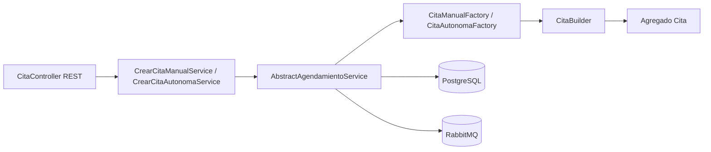

# Piedrazul Microservices

Sistema distribuido para la gestión de procesos clínicos: usuarios, personas (pacientes y médicos), citas y notificaciones, con una aplicación de escritorio **JavaFX** como cliente.

Este documento es la **guía oficial de onboarding** para el equipo. Cubre la configuración del **API Gateway**, **Keycloak**, **JWT** y todos los componentes necesarios para que el entorno local funcione igual para todos.

---

## Tabla de contenidos

1. [Visión general](#visión-general)
2. [Arquitectura y flujo de autenticación](#arquitectura-y-flujo-de-autenticación)
3. [Puertos y componentes](#puertos-y-componentes)
4. [Requisitos previos](#requisitos-previos)
5. [Configuración de Keycloak (paso a paso)](#configuración-de-keycloak-paso-a-paso)
6. [Configuración del API Gateway](#configuración-del-api-gateway)
7. [Configuración del frontend JavaFX](#configuración-del-frontend-javafx)
8. [Configuración de usuarios-service (Keycloak Admin)](#configuración-de-usuarios-service-keycloak-admin)
9. [Matriz de autorización del Gateway](#matriz-de-autorización-del-gateway)
10. [Variables de entorno](#variables-de-entorno)
11. [Ejecución local (orden recomendado)](#ejecución-local-orden-recomendado)
12. [Verificación y smoke tests](#verificación-y-smoke-tests)
13. [Obtener un JWT para pruebas](#obtener-un-jwt-para-pruebas)
14. [Registro de usuarios (flujo E2E)](#registro-de-usuarios-flujo-e2e)
15. [Servicios y responsabilidades](#servicios-y-responsabilidades)
16. [Troubleshooting](#troubleshooting)
17. [Deuda técnica / próximos pasos](#deuda-técnica--próximos-pasos)
18. [Funcionalidades recientes del producto](#funcionalidades-recientes-del-producto)
19. [Arquitectura DDD de citas-service](#arquitectura-ddd-de-citas-service)
20. [Autores](#autores)

---

## Visión general

| Componente | Rol |
|---|---|
| **Keycloak** | Identity Provider (IdP). Emite JWT, gestiona credenciales, roles y bloqueo de cuentas. |
| **api-gateway** | Punto de entrada único. Valida JWT y autoriza por rol antes de enrutar. |
| **usuarios-service** | Registro de usuarios en dominio + sincronización con Keycloak (Admin API). |
| **personas-service** | Datos de personas, pacientes, médicos y disponibilidad. |
| **citas-service** | Ciclo de vida de citas y configuración del sistema. |
| **notifications-service** | Notificaciones por eventos (RabbitMQ). |
| **piedrazul-frontend** | Cliente JavaFX. Login directo contra Keycloak; APIs de negocio vía Gateway. |

**Modelo de seguridad actual:** *gateway-perimétrico*.

- El **Gateway** es el único componente que valida JWT y aplica reglas por rol.
- Los microservicios downstream **confían** en el Gateway (no revalidan el token por ahora).
- El frontend **no** llama a `/api/auth/login` (eliminado). Autenticación = Keycloak OIDC.

### Arquitectura del repositorio

```text
piedrazul_microservices/
|- api-gateway/              Punto de entrada, JWT, autorización por rol
|- usuarios-service/         Registro + enlace con Keycloak Admin API
|- personas-service/         Personas, pacientes, médicos, disponibilidad
|- citas-service/            Citas, configuración, festivos (DDD + hexagonal)
|- notifications-service/    Notificaciones por eventos RabbitMQ
|- piedrazul-frontend/       Cliente JavaFX
`- README.md
```

---

## Arquitectura y flujo de autenticación

```text
                         +------------------+
                         |    Keycloak      |
                         |   (puerto 8080)  |
                         +--------+---------+
                                  |
                    login/refresh |  (Direct Access Grant)
                                  |
  +------------------+            |            +------------------+
  | piedrazul-       |  JWT Bearer |            |  API Gateway     |
  | frontend (JavaFX)|---------->|----------->|  (puerto 8085)   |
  +------------------+            |            +--------+---------+
                                  |                     |
                                  |         valida JWT + autoriza por rol
                                  |                     |
                                  |     +---------------+---------------+
                                  |     |               |               |
                                  v     v               v               v
                            usuarios   personas       citas      notifications
                            :8081      :8082          :8083         :8084
```

### Flujo de login

1. El usuario ingresa username/password en JavaFX.
2. `KeycloakAuthClient` llama a  
   `POST http://localhost:8080/realms/piedrazul/protocol/openid-connect/token`  
   con `grant_type=password` y `client_id=piedrazul-frontend`.
3. Keycloak devuelve `access_token` (JWT) + `refresh_token`.
4. `SessionManager` guarda los tokens y parsea claims (`usuario_id`, `persona_id`, roles).
5. Cada llamada REST al Gateway lleva `Authorization: Bearer <access_token>`.
6. El Gateway valida firma del JWT contra JWKS de Keycloak y aplica la matriz de roles.

### Flujo de registro (auto-servicio)

1. **Sin sesión:** el frontend crea Persona → Paciente/Médico → Usuario (POST públicos en Gateway).
2. `usuarios-service` recibe el POST, crea el usuario en **Keycloak** (Admin API) y persiste la fila local.
3. El usuario hace **login** contra Keycloak con las credenciales que acaba de registrar.

### Claims importantes en el JWT

| Claim | Origen | Uso |
|---|---|---|
| `sub` | Keycloak | UUID interno del usuario en Keycloak (`keycloak_user_id` en BD). |
| `preferred_username` | Keycloak | Username de login. |
| `realm_access.roles` | Keycloak | Roles de negocio (`PACIENTE`, `ADMINISTRADOR`, etc.). |
| `usuario_id` | Atributo custom en Keycloak | UUID de dominio (PK en `usuarios-service`). Principal en el Gateway. |
| `persona_id` | Atributo custom en Keycloak | FK lógica hacia `personas-service`. |

---

## Puertos y componentes

| Componente | Puerto | URL local típica |
|---|---|---|
| Keycloak | **8080** | http://localhost:8080 |
| api-gateway | **8085** | http://localhost:8085 |
| usuarios-service | 8081 | http://localhost:8081 |
| personas-service | 8082 | http://localhost:8082 |
| citas-service | 8083 | http://localhost:8083 |
| notifications-service | 8084 | http://localhost:8084 |
| PostgreSQL | 5432 | localhost:5432 |
| RabbitMQ | 5672 | localhost:5672 |

> **Nota:** Keycloak usa el 8080, por eso el Gateway está en **8085** (no en 8080 como en versiones anteriores del README).

---

## Requisitos previos

Instalar en la máquina de desarrollo:

- **JDK 21** recomendado (algunos módulos usan Java 17)
- **Maven 3.9+**
- **PostgreSQL**
- **RabbitMQ**
- **Keycloak** (instalación local o contenedor en puerto 8080)
- **Git**

Cuenta de administrador de Keycloak (por defecto en instalación local):

- URL admin: http://localhost:8080/admin
- Usuario/contraseña: los que configuraste al instalar Keycloak

---

## Configuración de Keycloak (paso a paso)

Todo el equipo debe usar el **mismo realm** y los **mismos clientes**. Sigue estos pasos en el Admin Console de Keycloak.

### 1. Crear el realm `piedrazul`

1. Abre http://localhost:8080/admin
2. En el dropdown superior izquierdo (donde dice `master`), click **Create realm**
3. **Realm name:** `piedrazul`
4. **Enabled:** ON → **Create**

Verifica que el issuer sea:

```text
http://localhost:8080/realms/piedrazul
```

Y el JWKS:

```text
http://localhost:8080/realms/piedrazul/protocol/openid-connect/certs
```

### 2. Crear realm roles (roles de negocio)

**Realm roles** → **Create role** (uno por uno):

| Role name | Descripción |
|---|---|
| `ADMINISTRADOR` | Administración del sistema |
| `AGENDADOR` | Agenda citas para pacientes |
| `MEDICO_TERAPISTA` | Médico / terapeuta |
| `PACIENTE` | Paciente que agenda sus citas |

### 3. Cliente público `piedrazul-frontend` (login desde JavaFX)

**Clients** → **Create client**

**Step 1 — General settings**

| Campo | Valor |
|---|---|
| Client type | OpenID Connect |
| Client ID | `piedrazul-frontend` |
| Name | Piedrazul Frontend (JavaFX) |

**Step 2 — Capability config**

| Campo | Valor |
|---|---|
| Client authentication | **OFF** (cliente público) |
| Standard flow | OFF |
| Direct access grants | **ON** ← necesario para login username/password desde JavaFX |
| Service accounts roles | OFF |

**Step 3 — Login settings:** dejar vacío → **Save**

**Settings adicionales** (pestaña del cliente):

- **Valid redirect URIs:** puede quedar vacío o `*` para desarrollo local
- **Web origins:** `*` (solo desarrollo)

### 4. Atributo de usuario `usuario_id`

**Realm settings** → **User profile** → **Create attribute**

| Campo | Valor |
|---|---|
| Attribute (Name) | `usuario_id` |
| Display name | Usuario ID (dominio) |
| Multivalued | OFF |
| Required | OFF |
| Who can edit? | Admins |
| Who can view? | Admins, Users |

**Save**

> Este atributo lo setea automáticamente `usuarios-service` al registrar un usuario. No lo llenes a mano salvo pruebas puntuales.

### 5. Protocol mapper `usuario_id` → JWT

**Clients** → `piedrazul-frontend` → **Client scopes** → click en `piedrazul-frontend-dedicated`

**Mappers** → **Configure a new mapper** → **User Attribute**

| Campo | Valor |
|---|---|
| Name | `usuario_id-mapper` |
| User Attribute | `usuario_id` |
| Token Claim Name | `usuario_id` |
| Claim JSON Type | String |
| Add to ID token | ON |
| Add to access token | ON |
| Add to userinfo | ON |

**Save**

### 6. Atributo de usuario `persona_id`

**Realm settings** → **User profile** → **Create attribute**

| Campo | Valor |
|---|---|
| Attribute (Name) | `persona_id` |
| Display name | Persona ID (dominio) |
| Multivalued | OFF |
| Required | OFF |
| Who can edit? | Admins |
| Who can view? | Admins, Users |

**Save**

### 7. Protocol mapper `persona_id` → JWT

Mismo client scope `piedrazul-frontend-dedicated` → **Mappers** → **User Attribute**

| Campo | Valor |
|---|---|
| Name | `persona_id-mapper` |
| User Attribute | `persona_id` |
| Token Claim Name | `persona_id` |
| Claim JSON Type | **Long** |
| Add to ID token | ON |
| Add to access token | ON |
| Add to userinfo | ON |

**Save**

### 8. Cliente confidential `piedrazul-admin-cli` (solo usuarios-service)

Este cliente **no** lo usa el frontend. Lo usa `usuarios-service` para crear usuarios vía Admin REST API.

**Clients** → **Create client**

**Step 1**

| Campo | Valor |
|---|---|
| Client ID | `piedrazul-admin-cli` |
| Name | Pie Drazul Admin CLI (usuarios-service) |

**Step 2 — Capability config**

| Campo | Valor |
|---|---|
| Client authentication | **ON** |
| Standard flow | OFF |
| Direct access grants | OFF |
| Service accounts roles | **ON** |

**Step 3:** vacío → **Save**

**Asignar permisos al service account**

1. Pestaña **Service accounts roles** del cliente `piedrazul-admin-cli`
2. **Assign role** → Filter by: **Filter by clients**
3. Cliente `realm-management` → marcar:
   - `manage-users`
   - `view-users`
   - `query-users`
   - `view-realm`
4. **Assign**

**Copiar el client secret**

1. Pestaña **Credentials**
2. Copiar **Client secret** → lo necesitarás en `usuarios-service` (ver sección correspondiente)

> **Nunca commitees el client secret al repositorio.** Usa variable de entorno en tu máquina.

### 9. (Opcional) Usuarios de prueba manuales para smoke tests

Si quieres correr el script `smoke-test-jwt.ps1`, crea estos usuarios en Keycloak (**Users** → **Create user**):

| Username | Rol | Password sugerida |
|---|---|---|
| `admin.test` | ADMINISTRADOR | `Abc123*` |
| `agendador.test` | AGENDADOR | `Abc123*` |
| `paciente.test` | PACIENTE | `Abc123*` |
| `medico.test` | MEDICO_TERAPISTA | `Abc123*` |

Para cada uno:

1. **Credentials** → Set password → **Temporary: OFF**
2. **Role mapping** → Assign realm role correspondiente

> Los usuarios creados **desde la app** (registro JavaFX) no necesitan crearse a mano: `usuarios-service` los crea en Keycloak automáticamente.

### 10. Verificar configuración de Keycloak

Obtén un token de prueba:

```powershell
$body = @{
    grant_type = 'password'
    client_id  = 'piedrazul-frontend'
    username   = 'TU_USERNAME'
    password   = 'TU_PASSWORD'
    scope      = 'openid'
}
$resp = Invoke-RestMethod `
    -Method POST `
    -Uri 'http://localhost:8080/realms/piedrazul/protocol/openid-connect/token' `
    -ContentType 'application/x-www-form-urlencoded' `
    -Body $body
$resp.access_token
```

Pega el token en https://jwt.io y verifica:

- `iss` = `http://localhost:8080/realms/piedrazul`
- `realm_access.roles` contiene el rol de negocio
- Tras registrar desde la app: `usuario_id` y `persona_id` presentes

---

## Configuración del API Gateway

Ubicación: `api-gateway/`

### Archivo principal

`api-gateway/src/main/resources/application.yml`

Parámetros clave:

```yaml
server:
  port: 8085

spring:
  security:
    oauth2:
      resourceserver:
        jwt:
          issuer-uri: ${KEYCLOAK_ISSUER_URI:http://localhost:8080/realms/piedrazul}
```

| Propiedad / env var | Descripción | Default |
|---|---|---|
| `server.port` | Puerto del Gateway | `8085` |
| `KEYCLOAK_ISSUER_URI` | Issuer OIDC del realm | `http://localhost:8080/realms/piedrazul` |

### Tabla de ruteo

El path que entra al Gateway es el **mismo** que llega al microservicio (sin reescritura).

| Path predicate | Destino |
|---|---|
| `/api/usuarios/**` | http://localhost:8081 |
| `/api/personas/**` | http://localhost:8082 |
| `/api/pacientes/**` | http://localhost:8082 |
| `/api/medicos/**` | http://localhost:8082 |
| `/api/disponibilidad/**` | http://localhost:8082 |
| `/api/citas/**` | http://localhost:8083 |
| `/api/configuracion/**` | http://localhost:8083 |
| `/api/notificaciones/**` | http://localhost:8084 |

Rutas bajo `/api/citas/**` que el Gateway enruta al mismo servicio (8083) sin regla extra:

- `/api/citas/disponibilidad/**` — validación de cambios de disponibilidad
- `/api/citas/especialidades` — catálogo para agendamiento autónomo

> **`/api/auth/**` ya no existe.** La autenticación vive en Keycloak.

### Seguridad (código)

La matriz de autorización está en:

```text
api-gateway/src/main/java/com/piedrazul/gateway/security/SecurityConfig.java
```

El converter de roles Keycloak → Spring Security está en:

```text
api-gateway/src/main/java/com/piedrazul/gateway/security/KeycloakRealmRolesConverter.java
```

### Compilar y arrancar

```bash
cd api-gateway
mvn clean spring-boot:run
```

Health check:

```bash
curl http://localhost:8085/actuator/health
curl http://localhost:8085/actuator/gateway/routes
```

---

## Configuración del frontend JavaFX

Ubicación: `piedrazul-frontend/`

### Archivo de configuración

`piedrazul-frontend/src/main/resources/application.properties`

```properties
# Gateway (TODAS las APIs de negocio pasan por aquí)
piedrazul.gateway.url=http://localhost:8085

# Keycloak (login y refresh de tokens — NO pasa por el Gateway)
piedrazul.keycloak.url=http://localhost:8080
piedrazul.keycloak.realm=piedrazul
piedrazul.keycloak.client-id=piedrazul-frontend
```

### Resolución en cascada

Tanto `ApiConfig` como `KeycloakConfig` resuelven cada valor así:

1. Variable de entorno (prioridad máxima)
2. `application.properties`
3. Default hardcoded en código

### Componentes de autenticación en el frontend

| Clase | Responsabilidad |
|---|---|
| `KeycloakConfig` | URL, realm, client-id |
| `KeycloakAuthClient` | Login (`password` grant) y refresh |
| `SessionManager` | Sesión, tokens, claims, refresh proactivo |
| `JwtClaims` | Parseo del payload JWT (sin validar firma) |
| `AuthenticatedHttpClient` | HTTP al Gateway con `Authorization: Bearer` |

**Comportamiento importante:** en pantallas **públicas** (registro), si no hay sesión activa, `AuthenticatedHttpClient` **no** envía header `Authorization`. El Gateway decide si la ruta es `permitAll`.

### Compilar y arrancar

```bash
cd piedrazul-frontend
mvn clean javafx:run
```

---

## Configuración de usuarios-service (Keycloak Admin)

Ubicación: `usuarios-service/`

### Qué hace hoy

- **Ya no** autentica usuarios (`POST /api/auth/login` eliminado).
- **Ya no** guarda passwords ni roles en PostgreSQL.
- Al registrar (`POST /api/usuarios`):
  1. Genera UUID de dominio (`usuario_id`).
  2. Crea usuario en Keycloak con atributos `usuario_id` y `persona_id`.
  3. Setea password y asigna realm roles.
  4. Persiste fila local enlazando `usu_id` ↔ `keycloak_user_id`.

### Base de datos

Archivo: `usuarios-service/src/main/resources/application.properties`

```properties
spring.datasource.url=jdbc:postgresql://localhost:5432/piedrazul_usuarios
spring.datasource.username=piedrazul
spring.datasource.password=db_piedrazul
```

**Primera vez / migración desde modelo viejo:**

Hibernate con `ddl-auto=update` **no borra** tablas/columnas antiguas (`rol`, `usuario_rol`, `password`, etc.). Lo recomendado:

```sql
DROP DATABASE IF EXISTS piedrazul_usuarios;
CREATE DATABASE piedrazul_usuarios OWNER piedrazul;
```

Luego arranca `usuarios-service`; Hibernate crea la tabla `usuario` nueva.

Esquema esperado:

```text
usuario(
  usu_id              UUID PRIMARY KEY,
  keycloak_user_id    UUID NOT NULL UNIQUE,
  username            VARCHAR(50) NOT NULL UNIQUE,
  per_id              BIGINT NOT NULL UNIQUE,
  fecha_creacion      TIMESTAMP NOT NULL,
  fecha_actualizacion TIMESTAMP NOT NULL
)
```

### Keycloak Admin API

En el mismo `application.properties`:

```properties
piedrazul.keycloak.admin.url=http://localhost:8080
piedrazul.keycloak.admin.realm=piedrazul
piedrazul.keycloak.admin.client-id=piedrazul-admin-cli
piedrazul.keycloak.admin.client-secret=<TU_SECRET_AQUI>
```

**Recomendado:** usar variable de entorno en lugar de pegar el secret en el archivo:

```powershell
# Windows PowerShell
$env:PIEDRAZUL_KEYCLOAK_ADMIN_CLIENT_SECRET = "tu-client-secret-de-keycloak"
```

Spring Boot mapea automáticamente `PIEDRAZUL_KEYCLOAK_ADMIN_CLIENT_SECRET` → `piedrazul.keycloak.admin.client-secret`.

### Seguridad interna del servicio

`usuarios-service` usa modelo **gateway-perimétrico**: `SecurityConfig` tiene `permitAll()` en todas las rutas. La protección real está en el Gateway.

### Endpoint principal

```http
POST /api/usuarios
Content-Type: application/json

{
  "personaId": 1,
  "username": "juan.perez",
  "password": "Test123*",
  "email": "juan@example.com",
  "firstName": "Juan",
  "lastName": "Perez",
  "roles": ["PACIENTE"]
}
```

---

## Matriz de autorización del Gateway

Resumen de `SecurityConfig.java` (estado actual):

| Ruta | Método | Acceso |
|---|---|---|
| `/actuator/**` | * | Público |
| `/api/usuarios` | POST | Público (auto-registro) |
| `/api/usuarios/**` | PUT, DELETE | Público (temporal, paridad sistema anterior) |
| `/api/usuarios/**` | GET | Autenticado (cualquier rol) |
| `/api/personas` | POST | Público (auto-registro) |
| `/api/personas/**` | GET | Autenticado |
| `/api/personas/**` | PUT, DELETE, PATCH | ADMINISTRADOR o AGENDADOR |
| `/api/pacientes` | POST | Público (auto-registro) |
| `/api/pacientes/**` | GET | Autenticado |
| `/api/pacientes/**` | otros | ADMINISTRADOR o AGENDADOR |
| `/api/medicos` | POST | Público (auto-registro) |
| `/api/medicos/**` | GET | Autenticado |
| `/api/medicos/**` | otros | ADMINISTRADOR |
| `/api/disponibilidad/**` | GET | Autenticado |
| `/api/disponibilidad/**` | escritura | ADMINISTRADOR o MEDICO_TERAPISTA |
| `/api/configuracion/**` | GET | Autenticado |
| `/api/configuracion/**` | escritura | ADMINISTRADOR |
| `/api/citas/**` | * | Autenticado |
| `/api/notificaciones/**` | * | Autenticado |
| cualquier otra | * | **Denegado (403/404)** |

**Códigos HTTP del Gateway:**

| Código | Significado |
|---|---|
| **401** | Sin token, token inválido o expirado |
| **403** | Token válido pero rol insuficiente |
| **503/504** | Microservicio downstream caído (la auth ya pasó) |

---

## Variables de entorno

Referencia consolidada para todo el stack:

| Variable | Componente | Descripción | Ejemplo |
|---|---|---|---|
| `KEYCLOAK_ISSUER_URI` | api-gateway | Issuer OIDC | `http://localhost:8080/realms/piedrazul` |
| `PIEDRAZUL_GATEWAY_URL` | frontend | URL base del Gateway | `http://localhost:8085` |
| `PIEDRAZUL_KEYCLOAK_URL` | frontend | URL base de Keycloak | `http://localhost:8080` |
| `PIEDRAZUL_KEYCLOAK_REALM` | frontend | Realm | `piedrazul` |
| `PIEDRAZUL_KEYCLOAK_CLIENT_ID` | frontend | Cliente público OIDC | `piedrazul-frontend` |
| `PIEDRAZUL_KEYCLOAK_ADMIN_CLIENT_SECRET` | usuarios-service | Secret de `piedrazul-admin-cli` | *(obtener de Keycloak)* |
| `PIEDRAZUL_TEST_PASSWORD` | smoke test | Password de usuarios `.test` | `Abc123*` |

Ejemplo de sesión PowerShell antes de arrancar servicios:

```powershell
$env:KEYCLOAK_ISSUER_URI = "http://localhost:8080/realms/piedrazul"
$env:PIEDRAZUL_GATEWAY_URL = "http://localhost:8085"
$env:PIEDRAZUL_KEYCLOAK_ADMIN_CLIENT_SECRET = "tu-secret-aqui"
```

---

## Ejecución local (orden recomendado)

### 1. Infraestructura

1. PostgreSQL en marcha
2. RabbitMQ en marcha
3. Keycloak en marcha (puerto 8080)
4. Bases de datos creadas por servicio (ver tabla siguiente)

| Servicio | Base de datos típica | Puerto app |
|---|---|---|
| usuarios-service | `piedrazul_usuarios` | 8081 |
| personas-service | `piedrazul_personas` | 8082 |
| citas-service | `piedrazul_citas` | 8083 |
| notifications-service | *(según tu config local)* | 8084 |

`citas-service` incluye `src/main/resources/application.properties` en el repo (PostgreSQL, RabbitMQ, colas y routing keys). Ajusta credenciales según tu entorno.

### 2. Microservicios backend

En **terminales separadas**, desde la carpeta de cada módulo:

```bash
mvn clean spring-boot:run
```

Orden sugerido:

| # | Servicio | Puerto |
|---|---|---|
| 1 | personas-service | 8082 |
| 2 | usuarios-service | 8081 |
| 3 | citas-service | 8083 |
| 4 | notifications-service | 8084 |
| 5 | **api-gateway** | **8085** |

> El Gateway puede arrancar aunque algún downstream esté caído; las rutas a ese servicio fallarán con 503 hasta que suba.

### 3. Frontend

```bash
cd piedrazul-frontend
mvn clean javafx:run
```

---

## Verificación y smoke tests

### Checks rápidos manuales

```bash
# Gateway vivo
curl http://localhost:8085/actuator/health

# Rutas cargadas (deben listar 8 rutas)
curl http://localhost:8085/actuator/gateway/routes

# Sin token → 401 en ruta protegida
curl -i http://localhost:8085/api/citas

# Ruta pública de registro → NO debe ser 401
curl -i -X POST http://localhost:8085/api/usuarios -H "Content-Type: application/json" -d "{}"
```

### Script automatizado (PowerShell)

```powershell
cd api-gateway\scripts
.\smoke-test-jwt.ps1
# o con password custom:
.\smoke-test-jwt.ps1 -Password 'Abc123*'
# o:
$env:PIEDRAZUL_TEST_PASSWORD = 'Abc123*'; .\smoke-test-jwt.ps1
```

Parámetros opcionales del script:

| Parámetro | Default |
|---|---|
| `-KeycloakUrl` | `http://localhost:8080` |
| `-GatewayUrl` | `http://localhost:8085` |
| `-Realm` | `piedrazul` |
| `-ClientId` | `piedrazul-frontend` |
| `-Password` | `Abc123*` o `$env:PIEDRAZUL_TEST_PASSWORD` |

El script valida:

- Actuator público
- 401 sin token en rutas protegidas
- Rutas públicas de registro
- Obtención de tokens por rol
- 403 cuando el rol no autoriza

> **Nota:** el script aún incluye una prueba legacy de `/api/auth/login`. Ese endpoint ya no existe; esa línea del script puede fallar sin afectar el funcionamiento real del sistema.

---

## Obtener un JWT para pruebas

### Opción A — PowerShell directo a Keycloak

```powershell
$body = @{
    grant_type = 'password'
    client_id  = 'piedrazul-frontend'
    username   = 'paciente.test'
    password   = 'Abc123*'
    scope      = 'openid'
}
(Invoke-RestMethod -Method POST `
    -Uri 'http://localhost:8080/realms/piedrazul/protocol/openid-connect/token' `
    -ContentType 'application/x-www-form-urlencoded' `
    -Body $body).access_token
```

### Opción B — Desde la app JavaFX (debug)

Tras login, en el debugger evalúa:

```java
SessionManager.getValidAccessToken()
```

### Opción C — Inspeccionar claims

Pega el `access_token` en https://jwt.io

---

## Registro de usuarios (flujo E2E)

1. Abre la pantalla **Registro** en JavaFX (sin estar logueado).
2. Completa datos de persona + username + password + rol.
3. El frontend ejecuta en orden:
   - `POST /api/personas` → Gateway → personas-service
   - `POST /api/pacientes` o `POST /api/medicos` (según rol)
   - `POST /api/usuarios` → Gateway → usuarios-service → Keycloak Admin API
4. Ve a login e inicia sesión con el username/password registrados.
5. Verifica JWT en jwt.io: deben aparecer `usuario_id`, `persona_id` y el rol.

**Requisitos para que funcione:**

- Keycloak configurado (secciones 1–8)
- `PIEDRAZUL_KEYCLOAK_ADMIN_CLIENT_SECRET` correcto en usuarios-service
- Gateway con reglas `permitAll` para POST de registro (ya configurado)
- personas-service y usuarios-service arriba

---

## Servicios y responsabilidades

### `api-gateway`

- Spring Cloud Gateway (WebFlux) + OAuth2 Resource Server
- Valida JWT contra Keycloak y autoriza por rol antes de enrutar
- CORS global habilitado para futuros clientes web
- Diagnóstico: `/actuator/health`, `/actuator/gateway/routes`

### `usuarios-service`

| Método | Ruta | Descripción |
|---|---|---|
| POST | `/api/usuarios` | Registro (Keycloak Admin API + fila local) |
| GET | `/api/usuarios/{id}` | Consulta por UUID de dominio |
| GET | `/api/usuarios/by-username/{username}` | Consulta por username |
| GET | `/api/usuarios` | Listado |

Keycloak es la fuente de verdad de credenciales y roles. No existe `POST /api/auth/login`.

### `personas-service`

| Área | Rutas principales |
|---|---|
| Personas | `POST/GET/PUT /api/personas`, `DELETE /api/personas/{id}/registro-fallido` (compensación si falla el registro) |
| Pacientes | `POST/GET /api/pacientes` |
| Médicos | `POST/GET /api/medicos`, `GET /api/medicos/activos`, `PATCH /api/medicos/{id}/estado`, `PUT /api/medicos/{id}/especialidades` |
| Disponibilidad | `POST/PUT/DELETE/GET /api/disponibilidad` |
| Catálogo | `GET /api/especialidades` (enum de especialidades médicas) |

Swagger: `http://localhost:8082/swagger-ui/index.html`

Eventos publicados hacia `citas-service`: paciente/médico creado o actualizado, disponibilidad creada/modificada/eliminada.

### `citas-service`

Microservicio con **DDD + arquitectura hexagonal** (ver sección dedicada más abajo).

| Área | Rutas principales |
|---|---|
| Citas | `POST /api/citas/manual`, `POST /api/citas/autonoma`, `PUT /api/citas/{id}/cancelar`, `PUT /api/citas/reagendar`, `PUT /api/citas/asistencia`, `GET /api/citas/medicos/{medicoId}/slots?pacienteId=`, `GET /api/citas/historial?medicoId=&pacienteId=&fecha=` |
| Configuración | `GET/PUT /api/configuracion` (semanas de agendamiento, etc.) |
| Festivos | `GET/PUT /api/configuracion/festivos` |
| Especialidades | `GET /api/citas/especialidades` |
| Validación disponibilidad | `POST /api/citas/disponibilidad/validar-eliminacion`, `POST /api/citas/disponibilidad/validar-modificacion` |

Swagger: `http://localhost:8083/swagger-ui/index.html`

Reglas de negocio destacadas:

- Validación de **solapamiento** de citas por paciente (`PacienteNoDisponibleException`)
- Restricción de **24 h** en agendamiento autónomo (`RestriccionAutoservicioException`)
- Bloqueo de edición/eliminación de disponibilidad si hay citas activas (`DisponibilidadConCitasActivasException`)
- Eventos de salida enriquecidos con datos reales de snapshots (nombre/email paciente y médico)

### `notifications-service`

- Notificaciones y consumo de eventos RabbitMQ (`CITA_AGENDADA`, `CITA_CANCELADA`, etc.)
- Configurar `server.port=8084` en su `application.properties` local

### `piedrazul-frontend`

Cliente JavaFX. **Todas** las APIs de negocio pasan por el Gateway (`http://localhost:8085`); login/refresh solo contra Keycloak.

| Rol | Funcionalidades en la app |
|---|---|
| Todos | Login Keycloak, registro con compensación si falla un paso |
| PACIENTE | Dashboard, agendamiento autónomo por especialidad/médico/slot, historial de citas |
| MEDICO_TERAPISTA | Dashboard, mis citas |
| AGENDADOR | Dashboard, historial de citas |
| ADMINISTRADOR | Configuración de parámetros y disponibilidades (crear/editar/eliminar), festivos, administración de usuarios, registro de staff |

Patrones en frontend: **Decorator** en flujo de cita (`CitaBase`, `PrioridadAltaDecorator`, `RecordatorioDecorator`).

---

## Troubleshooting

### Error: `Error en PersonaClient` al registrar (sin sesión)

**Causa:** el frontend intentaba enviar Bearer sin sesión activa, o el Gateway no tenía `permitAll` en POST de personas/pacientes/medicos.

**Solución:** asegúrate de tener la versión actual del frontend y Gateway. Reinicia ambos.

### Error: `No hay sesion activa` / 401 en pantallas que requieren login

**Causa:** token expirado o no se hizo login.

**Solución:** vuelve a iniciar sesión. El frontend refresca tokens automáticamente mientras el refresh token sea válido.

### usuarios-service: `Error de credenciales con piedrazul-admin-cli`

**Causa:** `client-secret` incorrecto o cliente mal configurado.

**Solución:**

1. Keycloak → Clients → `piedrazul-admin-cli` → Credentials → copiar secret
2. Setear `PIEDRAZUL_KEYCLOAK_ADMIN_CLIENT_SECRET`
3. Verificar service account roles (`manage-users`, `view-users`, `query-users`, `view-realm`)

### Gateway: 401 en todo con token aparentemente válido

**Verificar:**

1. `issuer-uri` del Gateway = issuer del token (`iss` en jwt.io)
2. Keycloak accesible desde la máquina del Gateway
3. Reloj del sistema sincronizado (JWT expira por `exp`)

### Gateway: 403 con token válido

**Causa:** el rol del usuario no autoriza esa ruta (ver matriz arriba).

**Solución:** asigna el realm role correcto en Keycloak.

### Registro OK pero login falla

**Verificar en Keycloak Admin → Users:**

- Usuario existe con el username registrado
- Password no temporal
- Tiene realm role asignado (`PACIENTE`, etc.)

### JWT sin `usuario_id` o `persona_id`

**Causa:** usuario creado manualmente en Keycloak sin pasar por `usuarios-service`, o mappers/atributos no configurados.

**Solución:** registrar desde la app o setear atributos + verificar mappers (secciones 4–7).

### Gateway devuelve 503/504

**Causa:** microservicio downstream caído.

**Solución:** revisa logs del servicio destino y que el puerto en `application.yml` del Gateway coincida.

### No puedo iniciar sesión con usuarios viejos (pre-Keycloak)

**Esperado.** Las credenciales antiguas vivían en PostgreSQL del usuarios-service. Tras la migración, **Keycloak es la fuente de verdad**. Hay que registrarse de nuevo desde la app.

---

## Deuda técnica / próximos pasos

| Fase | Descripción |
|---|---|
| **Fase 4** | Defense in depth: OAuth2 Resource Server también en microservicios downstream |
| **Fase 5** | Endurecer reglas de registro: POST `/api/usuarios` solo PACIENTE auto-registro; staff solo vía ADMIN |
| **Futuro** | Migrar JavaFX de Direct Access Grant a Authorization Code + PKCE (más seguro para cliente público) |
| **Futuro** | Actualizar `smoke-test-jwt.ps1` para eliminar prueba de `/api/auth/login` y reflejar POST públicos de registro |

---

## Funcionalidades recientes del producto

Resumen de evolución reciente del repositorio (además de la migración Keycloak + Gateway):

| Área | Cambio |
|---|---|
| Seguridad | API Gateway en **8085**, JWT Keycloak, registro E2E sin `/api/auth/login` |
| Citas | Refactor DDD/hexagonal: Factory inyectada, puerto de eventos completo, excepciones de dominio, eventos con datos reales |
| Agendamiento | Autónomo por especialidad, validación de solapamiento por paciente, slots con `pacienteId` |
| Configuración | Festivos (admin), semanas de agendamiento, validación antes de editar/eliminar disponibilidades |
| Personas | Especialidades en médicos, compensación `registro-fallido`, más eventos RabbitMQ |
| Frontend | Administración de usuarios (admin), pantallas de citas por rol, UX DatePicker autónomo |
| Disponibilidad | Editar y eliminar bloques con validación contra citas activas en `citas-service` |

---

## Arquitectura DDD de citas-service

El microservicio `citas-service` implementa **Domain-Driven Design** y **Arquitectura Hexagonal** (Ports & Adapters), alineado al taller del curso (punto 3: microservicio con lógica de negocio rica).

### Vista por capas

```text
citas-service/
`- src/main/java/com/piedrazul/citas/
   |- domain/                Reglas de negocio puras
   |  |- model/              Cita, snapshots, configuración, festivos
   |  |- valueobjects/       CitaId, PacienteId, MedicoId, UsuarioId
   |  |- builder/            CitaBuilder (Builder Pattern)
   |  |- factory/            CitaBuilderFactory + impls (Factory Pattern)
   |  `- exception/          Lenguaje ubicuo de errores
   |
   |- application/           Casos de uso / orquestación
   |  |- port/incoming/      Puertos de entrada (use cases)
   |  |- port/outgoing/      Puertos de salida
   |  |- service/            Implementación de casos de uso
   |  |  `- agendamiento/    AbstractAgendamientoService (Template Method)
   |  |- dto/                Requests/responses de aplicación
   |  `- mapper/             Dominio -> respuesta API
   |
   |- infrastructure/        Adaptadores técnicos
   |  |- persistence/        JPA + PostgreSQL
   |  |- messaging/          RabbitMQ publishers/consumers
   |  `- config/             Spring, RabbitMQ, OpenAPI
   |
   `- interfaces/rest/       Adaptadores de entrada HTTP
      |- controller/         REST + validación
      |- dto/                Contratos REST
      `- exception/          GlobalExceptionHandler
```

### Puertos y adaptadores

**Entrada (use cases → controllers REST):**

| Puerto | Adaptador |
|---|---|
| `CrearCitaManualUseCase` | `POST /api/citas/manual` |
| `CrearCitaAutonomaUseCase` | `POST /api/citas/autonoma` |
| `CancelarCitaUseCase` | `PUT /api/citas/{id}/cancelar` |
| `ReagendarCitaUseCase` | `PUT /api/citas/reagendar` |
| `MarcarAsistenciaUseCase` | `PUT /api/citas/asistencia` |
| `ConsultarSlotsDisponiblesUseCase` | `GET /api/citas/medicos/{id}/slots` |
| `ListarCitasUseCase` | `GET /api/citas/historial` |
| `ConsultarConfiguracionUseCase` / `ActualizarConfiguracionUseCase` | `/api/configuracion` |

**Salida (puertos → infraestructura):**

| Puerto | Adaptador |
|---|---|
| `CitaRepositoryPort` | `CitaRepositoryImpl` (JPA) |
| `PacienteSnapshotRepositoryPort` | `PacienteSnapshotRepositoryImpl` |
| `MedicoSnapshotRepositoryPort` | `MedicoSnapshotRepositoryImpl` |
| `DisponibilidadSnapshotRepositoryPort` | `DisponibilidadSnapshotRepositoryImpl` |
| `ConfiguracionRepositoryPort` | `ConfiguracionRepositoryImpl` |
| `CitaEventPublisherPort` | `CitaEventPublisherImpl` (RabbitMQ) |

Consumers en `infrastructure/messaging/consumer/` sincronizan snapshots desde `personas-service` (anti-corruption layer del bus).

### Patrones de diseño (requisito del curso)

- **Builder** — `CitaManualBuilder`, `CitaAutonomaBuilder`: validan y construyen el agregado `Cita`.
- **Factory** — `CitaManualFactory`, `CitaAutonomaFactory`: inyectadas en los servicios de agendamiento vía `CitaBuilderFactory`.
- **Template Method** — `AbstractAgendamientoService.crearCita()`: algoritmo común; hooks por tipo (`validarTipoAgendamiento`, factory del builder).
- **Singleton** — `ConfiguracionManager`: configuración en memoria del sistema.

### Excepciones de dominio y HTTP

| Excepción | HTTP típico |
|---|---|
| `CitaNoEncontradaException` | 404 |
| `PacienteNoExisteException` | 404 |
| `MedicoNoDisponibleException` | 409 |
| `DisponibilidadNoDisponibleException` | 409 |
| `PacienteNoDisponibleException` | 409 |
| `DisponibilidadConCitasActivasException` | 409 |
| `CitaNoCancelableException` | 400 |
| `CitaNoReagendableException` | 409 |
| `CitaNoMarcableException` | 409 |
| `RestriccionAutoservicioException` | 400 |

Mapeo centralizado en `interfaces/rest/exception/GlobalExceptionHandler`.

### Eventos de dominio (salida)

`CitaEventPublisherPort` publica con datos reales del paciente y médico (snapshots), no placeholders:

- `CITA_AGENDADA` — al crear cita (manual o autónoma)
- `CITA_CANCELADA` — al cancelar
- `CITA_REAGENDADA` — al reagendar (incluye fecha original)

### Flujo de agendamiento (Template Method + Factory + Builder)



### Configuración local (`application.properties`)

Ubicación: `citas-service/src/main/resources/application.properties`

Incluye: `server.port=8083`, datasource `piedrazul_citas`, RabbitMQ, exchanges, routing keys y colas de consumo (`paciente-creado`, `medico-actualizado`, `disponibilidad-modificada`, etc.).

### Pruebas

```bash
cd citas-service
mvn test
```

Suite actual: **49 tests** unitarios de dominio (agregado `Cita`, builders, value objects, snapshots).

Refactors recientes validados: uso real de Factory en agendamiento, contrato `publicarCitaReagendada` en el puerto, excepciones de dominio explícitas, eventos enriquecidos con snapshots.

---

## Autores

- Carlos Eduardo Dorado Joaqui
- Rhony Daniel Martinez Benavides
- Juan Esteban Moscoso Salazar
- Andres Felipe Obando Quintero
- Ronal Santiago Valdez Jurado
